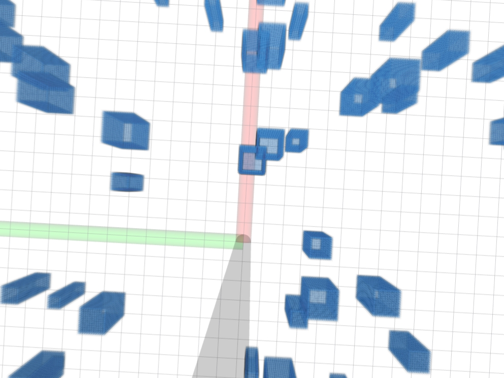

# 1. Overview
This project combines three previous projects from ZJU-FAST-Lab: ego-planner, Elastic-Tracker, Fast-Perching. By running a single bash file, you can run one of these projects in one unified simulation environment.
# 1.1 External Runtime Mode (No Legacy Simulator)
- `Elastic-Tracker` now supports `planning/real_external.launch`, which consumes:
  - odom topic (default: `/ekf/ekf_odom`)
  - yolo topic (default: `/yolov5trt/bboxes_pub`)
  - local map topic (default: `/drone_0_ego_planner_node/grid_map/occupancy_inflate`)
- Legacy simulator/CUDA packages are isolated with `CATKIN_IGNORE` and are not built in default Docker workflow.
- `scripts/stop_*.sh` are lightweight wrappers now; heavy stop logic is implemented in `utils/stop_task_helper.py`.

# 2. Standard Compilation
**System used to test**: Ubuntu 20.04 with ros-noetic  

**[NOTE!]** CUDA is no longer required in default build path for this repo copy.
> Clone the code from github
```
git clone https://github.com/wuuwuu26/Integrated-Simulation.git
```
> Compile each package one by one
```
cd ego-planner
catkin_make
```
```
cd Elastic-Tracker
catkin_make
```
```
cd Fast-Perching
catkin_make
```
> Grant bash files permissions
```
chmod +x scripts/mix.sh
chmod +x scripts/task_pub.sh
chmod +x scripts/start_ego.sh
chmod +x scripts/start_track.sh
chmod +x scripts/start_perch.sh
chmod +x scripts/stop_ego.sh
chmod +x scripts/stop_track.sh
chmod +x scripts/stop_perch.sh
```
> Run all runtimes (ego + track + perch) in standby mode
```
./scripts/mix.sh
```

> Trigger modules by direct topics/tools
```
./scripts/task_pub.sh
```
> (Optional) direct trigger examples
```
python3 tools/trigger_ego.py
python3 tools/trigger_track.py --no-fake-inputs --duration 2
python3 tools/trigger_track_land.py
python3 tools/trigger_perch.py
```
# 3. About the Map
If you want to change the map, please turn to `/ego-planner/src/planner/plan_manage/launch/map_generator.launch`. You can change the parameters of `mockamap_node` to get a different environment for simulation.
```
<param name="seed" type="int" value="510"/>
<param name="update_freq" type="double" value="1.0"/>

<!-- Box edge length, unit: meter -->
<param name="resolution" type="double" value="0.1"/>

<!-- Map size unit: meter -->
<param name="x_length" value="$(arg map_size_x_)"/>
<param name="y_length" value="$(arg map_size_y_)"/>
<param name="z_length" value="$(arg map_size_z_)"/>

<!-- Map generation type: 2 = perlin box random map -->
<param name="type" type="int" value="2"/>
    
<!-- Ground parameter: 1 = enable ground, 0 = disable ground -->
<param name="ground" type="int" value="0"/>
    
<!-- Perlin box random map parameters -->
<param name="width_min" type="double" value="0.5"/>
<param name="width_max" type="double" value="1.5"/>
<param name="height_min" type="double" value="3.5"/>
<param name="height_max" type="double" value="4.5"/>
<param name="obstacle_number" type="int" value="120"/>
```
# 4. Existing Problems
As for task 4, given that there's no obstacle avoidance program in Fast-Perching project, task 4 here can't avoid the obstacles in the map. 
